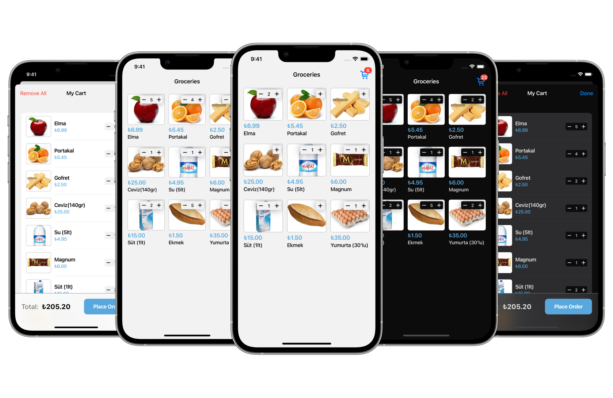

# AppLogist Assignment App

> This project was made within "AppLogist iOS Assignment".

## Architecture

MVVM architecture was used in this project.

## Compatibility

Requires iOS 11.0 or later. Compatible with iPhone.

## API

- **[API Postman Collection](https://documenter.getpostman.com/view/7416786/TVK781x3)**

## Third Party Libraries

> Added via Swift Package Manager.

- **[Alamofire](https://github.com/Alamofire/Alamofire)**
- **[Nuke](https://github.com/kean/Nuke)**
- **[LBTATools](https://github.com/bhlvoong/LBTATools)**
